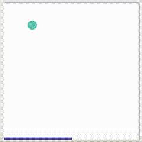
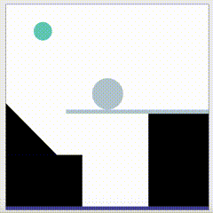
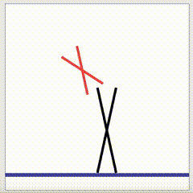
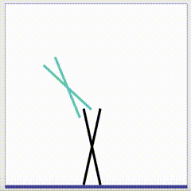
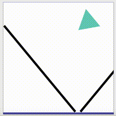
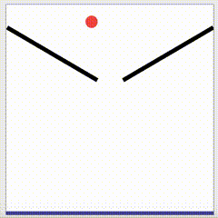

**Causal-PHYRE** aspires to be a benchmark for causal physical reasoning. It is build upon [**PHYRE**](https://github.com/facebookresearch/phyre). Though it uses the sample simulation engine as PHYRE, Causal-PHYRE allows for intervention and thus, causal discovery.

It contains 21 sets of tasks. Each task has been derived from a pre-determined causal graph. Table below shows a set of tasks along with the corresponding causal graph. Each task has a goal state, such as a ball meeting floor. Different **task templates** have different initializations. Each task has been deviced in a manner which contains a **target** (ie. crietria satisfying the goal state), **cause** of the target, and a **correlate** of the target. Tasks and the corresponding templates can be explored in the [demo](causalai.net).

In the graphs below, 


|Graph| Success | Failure  | 
|:-------------:|:-------------:|:-----:|
|  |  | |
|  |  | |
| |  | |
| |  | |
| |  | |
| |  | |


Brief summary of the tasks is given below :-

| Task ID     | Cause         | Correlate|
| ------------- |:-------------:| -----:|
| 31 | Position | Color |
| 32 | Position | Color |
| 33 | Position | Color |
| 34 | Position | Color |
| 35 | Position | Color |
| 36 | Position | Color |
| 37 | Position | Color |
| 38 | Size | Color |
| 39 | Angle | Color |
| 40 | Angle | Color |
| 41 | Angle | Color |
| 42 | Size| Color |
| 43 | Angle | Color |
| 44 | Angle | Color |
| 45 | Position | Shape |
| 46 | Position | Shape |
| 47 | Position | Shape |
| 48 | Angle | Color |
| 49 | Position | Shape |
| 50 | Angle | Color |
| 51 | Position | Shape |


Apart from providing a set of tasks, Causal-PHYRE also allows the user to intervene on a particular task. The intervention is realized through putting an object in the task environment (such as a ball) and check if this intervention results in the goal state. As an example

|Status| Graph | Task | 
|:----------:|:-------------:|:-------------:|
| Before Intervention |  | |
| After Intervention |  | |


### Installation 

The recommended way to install and compile Causal-PHYRE from source is by using a [Conda](https://docs.conda.io/en/latest/) package manager.

```(bash)
git clone https://github.com/lovish1234/CausalComputerVision.git
cd dataset_creation
conda env create -f env.yml
source activate causal-phyre
pip install -e src/python

```

To check that the installation was successful, run `python -m phyre.server` and open http://localhost:30303. That should start a local demo server containing all the tasks and corresponding task templates.


A model trained on Causal-PHYRE benchmark is expected to learn the correlation between the co-variates, which in the above case include both the original cause and confounder. A model that understands the cause is bound to make decisions only using the cause and ignore the confounder.

### Important Files

- `dataset_creation/src/python/phyre/creator/constants.py` - 
	- To introduce a new object category such as triangle
	- To change color of causal objects
- `dataset_creation/src/python/phyre/creator/shapes.py` - 
	-  To define the arguments associated with new object category such as triangle
- `dataset_creation/src/python/phyre/creator/creator.py` -
	- *over* argument recolors the object depending on the causal structure
- `dataset_creation/data/task_scripts/main/task000*` -
	- Task scripts corresponding to each task
	- Every task contains a confounder and cause 

### Adding new tasks

To generate the tasks using the scripts

`python generate_tasks.py data/task_scripts/main/ data/generated_tasks/  --with-eval-stats --save-single-pickle`

To activate the server for viewing

`python -m phyre.server`

To view the existing tasks

`http://localhost:30303`